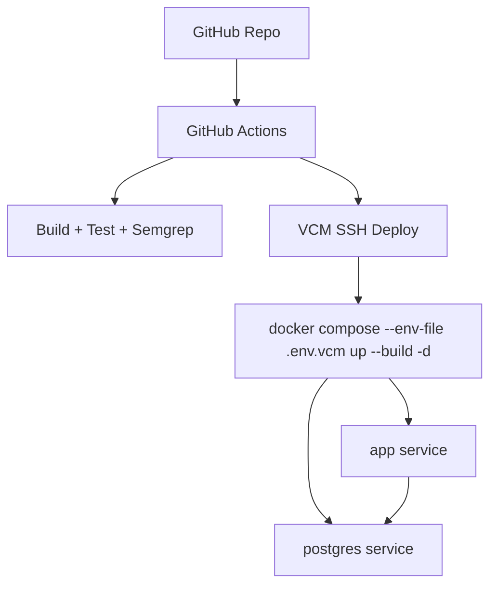

# Deployment Architecture

## Classroom deployment path

- Preferred local/deployment startup:
  - `docker compose up --build`
- Services:
  - `app`
  - `db`

## Automatic VCM deployment path

- Workflow:
  - `.github/workflows/deploy-vcm.yml`
- Remote deploy script:
  - `scripts/deploy_vcm.sh`
- Trigger:
  - push to `main`
  - manual `workflow_dispatch`

## VCM deployment behavior

1. GitHub Actions checks out the repo
2. The workflow copies the classroom repo to the VCM over SSH
3. The workflow writes `.env.vcm` on the VCM from GitHub secrets
4. The workflow runs `scripts/deploy_vcm.sh`
5. The script prefers:
   - `docker compose --env-file .env.vcm up --build -d`
6. If Docker is unavailable on the VCM, the script falls back to:
   - backend venv install
   - frontend build
   - gunicorn startup
7. The deploy script performs a local health check against:
   - `http://127.0.0.1:5000/api/health`
   before treating deployment as successful

## Evidence

- `.github/workflows/build.yml`
- `.github/workflows/tests.yml`
- `.github/workflows/semgrep.yml`
- `.github/workflows/deploy-vcm.yml`
- `docker-compose.yml`
- `scripts/deploy_vcm.sh`
