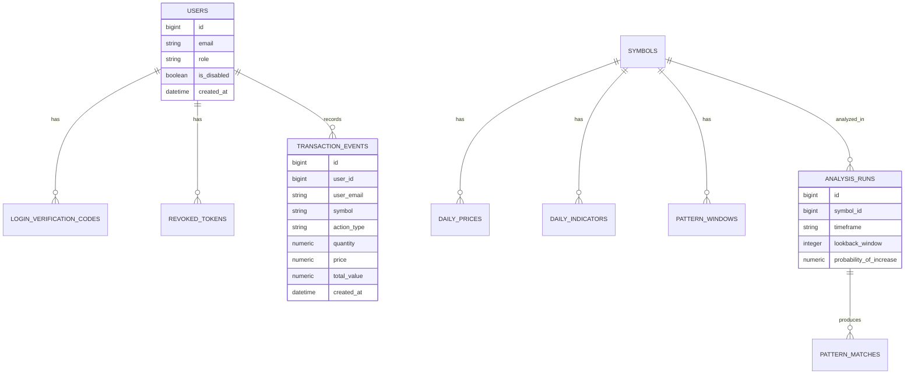

# ERD

```mermaid
erDiagram
  USERS ||--o{ LOGIN_VERIFICATION_CODES : has
  USERS ||--o{ REVOKED_TOKENS : has
  USERS ||--o{ TRANSACTION_EVENTS : records
  SYMBOLS ||--o{ DAILY_PRICES : has
  SYMBOLS ||--o{ DAILY_INDICATORS : has
  SYMBOLS ||--o{ PATTERN_WINDOWS : has
  SYMBOLS ||--o{ ANALYSIS_RUNS : analyzed_in
  ANALYSIS_RUNS ||--o{ PATTERN_MATCHES : produces

  USERS {
    bigint id
    string email
    string role
    boolean is_disabled
    datetime created_at
  }

  TRANSACTION_EVENTS {
    bigint id
    bigint user_id
    string user_email
    string symbol
    string action_type
    numeric quantity
    numeric price
    numeric total_value
    datetime created_at
  }

  ANALYSIS_RUNS {
    bigint id
    bigint symbol_id
    string timeframe
    integer lookback_window
    numeric probability_of_increase
  }
```

## Classroom-relevant entities

- `users`
- `transaction_events`
- `analysis_runs`
- `pattern_matches`
- `symbols`
- `daily_prices`
- `daily_indicators`
