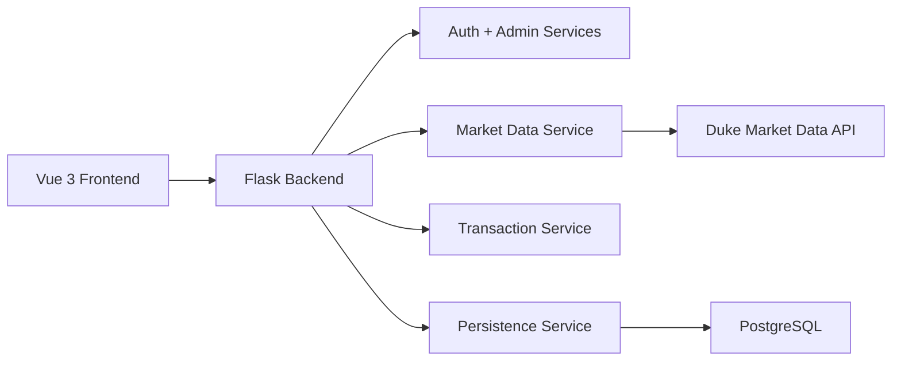

# System Architecture

## Notes

- The frontend handles presentation and user interaction.
- The backend owns authentication, admin control, transaction logging, analytics, and quant processing.
- PostgreSQL is the formal classroom persistence layer.
- SQLite remains a fallback only for emergency local testing.
