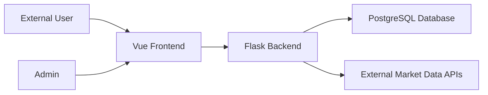

# DFD Threat Model

## Overview

Noob Trade has six main actors/components:

- External User
- Admin
- Vue Frontend
- Flask Backend
- PostgreSQL Database
- External Market Data APIs

## Data Flow Diagram

## Trust Boundaries

1. Browser to backend API
2. Backend to database
3. Backend to external market API
4. Admin-only routes versus regular user routes

## Key Threats and Mitigations

- Credential theft
  - Mitigation: bcrypt password hashing, JWT in HttpOnly cookies, rate limiting, lockout after repeated failures
- Privilege escalation
  - Mitigation: `admin_required` guards on admin routes, role checks on sensitive actions
- Disabled user continuing access
  - Mitigation: disabled users are blocked at login and on authenticated route checks
- Strategy leakage
  - Mitigation: quant logic remains on the backend; frontend only receives result payloads
- Mass request abuse
  - Mitigation: per-route rate limiting in Flask
- Data tampering
  - Mitigation: server-side validation for auth, transactions, admin actions, and symbol inputs

## Admin-only Sensitive Operations

- Disable / enable user accounts
- Reset user passwords
- View system transactions
- View platform analytics
- View recent system logs
